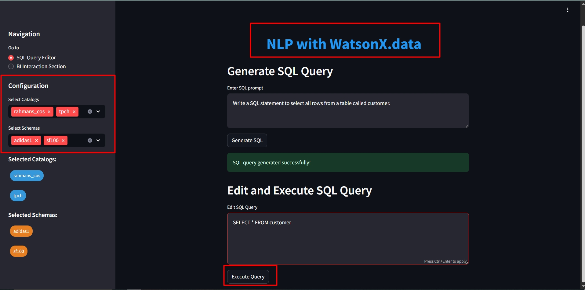
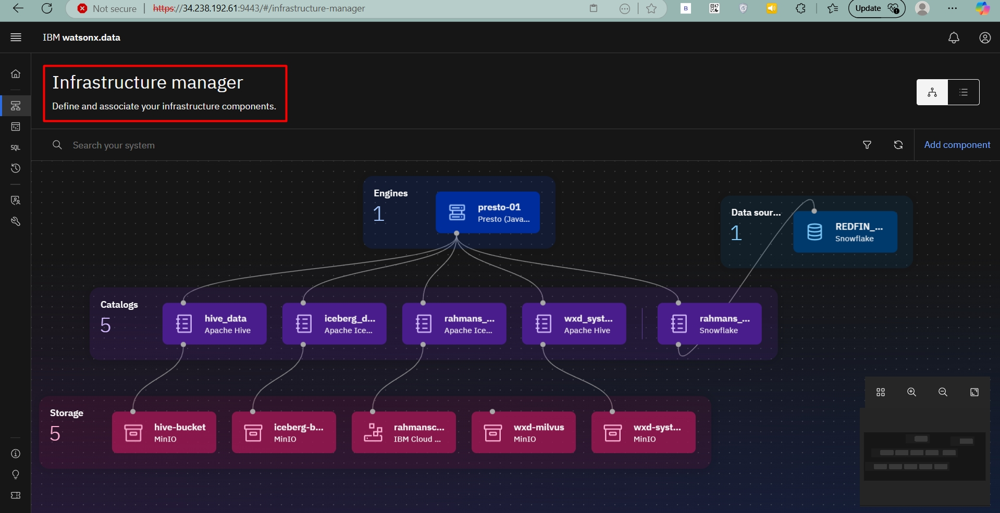
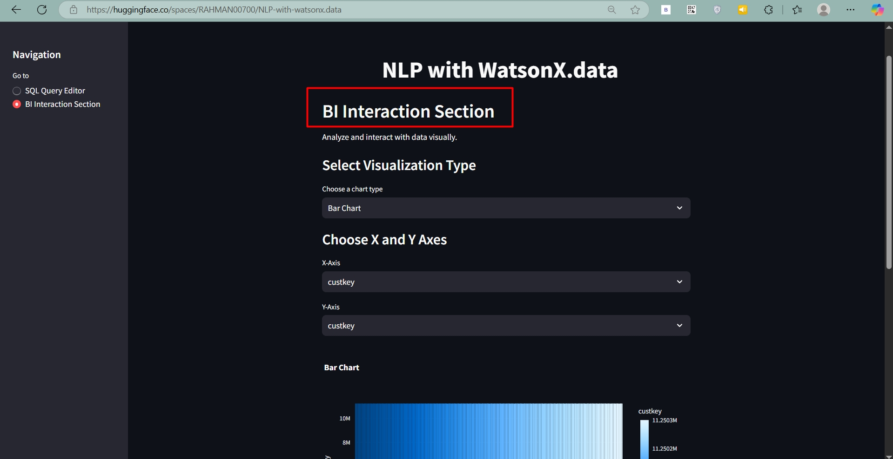

# AI-Powered Data Querying & Visualization with Watsonx.ai and Watsonx.data 🚀



## Introduction
Unlock the power of AI-driven data querying and visualization with Watsonx.ai and Watsonx.data. This project enables users to generate SQL queries using AI, execute them seamlessly, and visualize results using BI tools—all in one streamlined workflow.

## Key Features 🔥
✅ **AI-powered SQL generation** – Generate SQL queries using Watsonx.ai.
✅ **Seamless execution** – Run queries on Watsonx.data and retrieve results.
✅ **Interactive visualization** – Use BI tools for insightful data representation.

---

## Setup Guide 🛠️

### 1️⃣ Clone the Repository
```bash
git clone https://github.com/Abd-al-RahmanH/AI-Powered-Data-Querying-Visualization-with-Watsonx.ai-and-Watsonx.data.git

cd AI-Powered-Data-Querying-Visualization-with-Watsonx.ai-and-Watsonx.data
```

### 2️⃣ Install Dependencies
```bash
pip install -r requirements.txt
```

### 3️⃣ Configure Watsonx.ai Credentials
Update the `credentials` and `presto credentials` dictionary in `app.py`:
```python
credentials = {
    "url": "https://us-south.ml.cloud.ibm.com",
    "apikey": "YOUR_API_KEY"
}
project_id = "YOUR_PROJECT_ID"
```

### 4️⃣ Run the Application 🚀
```bash
streamlit run app.py
```

---

## How It Works 🔍

### **Watsonx.data UI**
- This is watsonx.data Infrastructure Manager
  


### **1️⃣ Generate SQL Query using AI**
- Enter a natural language question.
- Watsonx.ai generates the SQL query.


### **2️⃣ Execute Query on Watsonx.data**
- The generated query runs on Watsonx.data.
- The below image shows we will get the data without logging into watsonx.data
  

- Results are retrieved for visualization.


### **3️⃣ Visualize Results in BI Tool**
- The query results are displayed using interactive charts and graphs.




---

## Live Demo 🎯
Check out the live demo on Hugging Face Spaces:
[](https://huggingface.co/spaces/RAHMAN00700/newnlp)

## Future Enhancements ✨
🚀 Support for multiple database connections.
📊 Advanced AI-driven analytics.
🔄 Integration with other cloud platforms.

## Conclusion 🎯
This project simplifies AI-powered data querying and visualization, making data analysis seamless and interactive. Try it out and contribute to future enhancements!

🔗 **GitHub Repo**: [AI-Powered Data Querying & Visualization](https://github.com/Abd-al-RahmanH/AI-Powered-Data-Querying-Visualization-with-Watsonx.ai-and-Watsonx.data)

